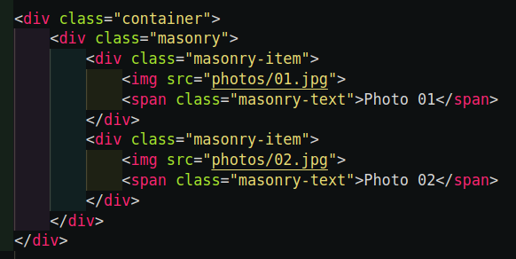
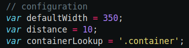

# Old-fashioned masonry

The purpose of this project was to display the masonry-type layout on the **older browsers**. **Without grid. Without flexbox.** It will work just fine also on the new ones.

Main assumptions:
* the size of the masonry is related to the size of its container
* all columns are equal in width
* content is displayed from left to right, when placing the new image, the shortest column is filled
* works without grid and flexbox
* reacts to the browser resize

Because I wanted this to be as simple as possible, I used jQuery instead of trying to find a vanila JavaScript methods that will work for all major, older browsers. 

---

## How to use

Place the container and masonry items in your HTML file like this:



Remember to load `jQuery` and `masonry.js` in your HTML file.

```
<script src="https://code.jquery.com/jquery-3.5.1.slim.min.js"
    integrity="sha256-4+XzXVhsDmqanXGHaHvgh1gMQKX40OUvDEBTu8JcmNs=" crossorigin="anonymous"></script>

<script src="js/masonry.js"></script>
```

In the `js/masonry.js` set the configuration variables if needed:



The `defaultWidth` is the default width of the colum. The number of columns and the item sizes will be calculated based on this value. 

The `distance` is the distance between items (in pixels).

The `containerLookup` is the jQuery lookup for the container element. The number of columns and positions of items are calculated based on the width of the element. 